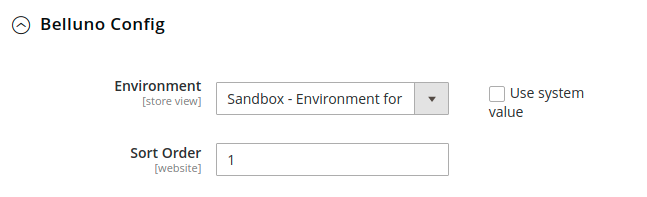
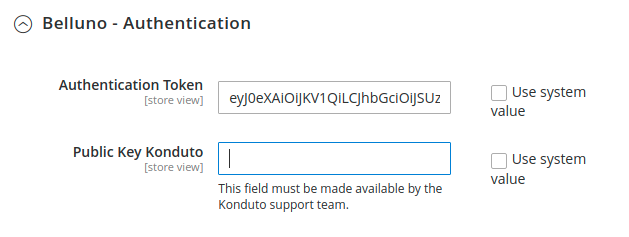
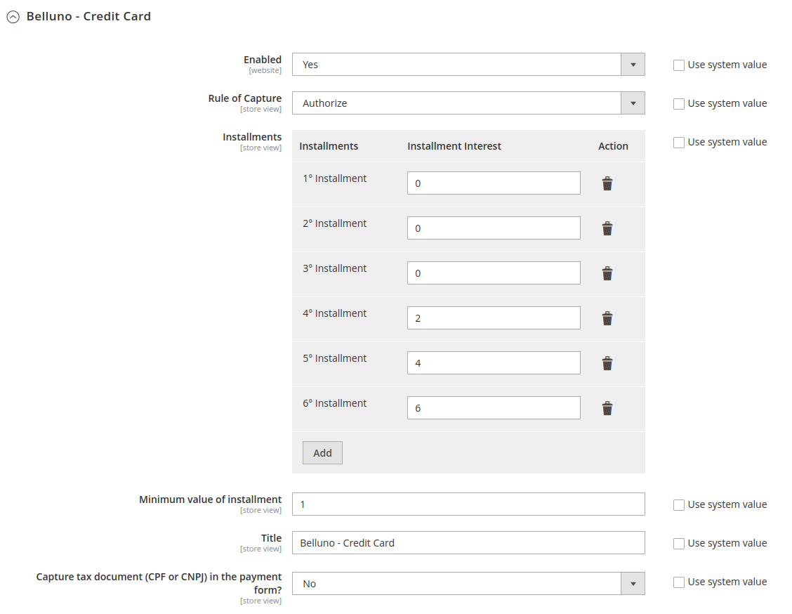
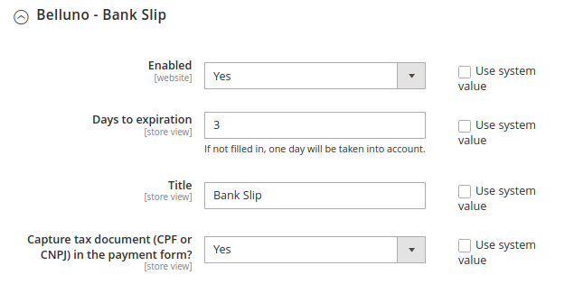
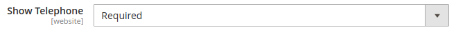
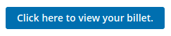
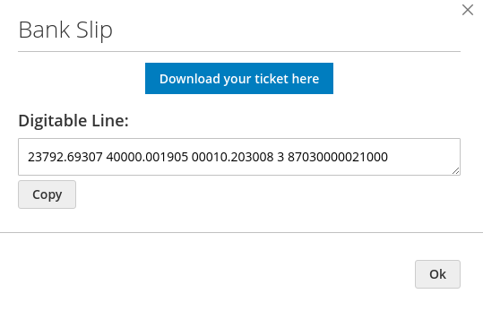
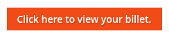
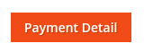
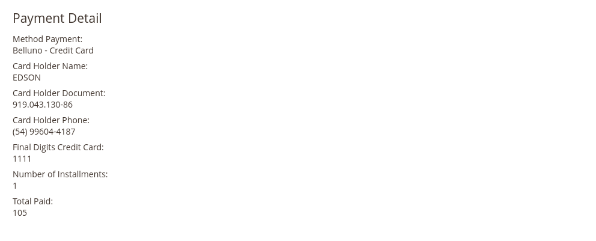

# **[Belluno Payments Integration Module](README.md)**

### *Installation*

------

We recommend that you have a testing environment to validate changes and updates before updating your store in production. Also that all information is backed up before performing any update/installation procedure.

------

### **Compatibility Versions**

*Magento 2.4.X & PHP 7.4*

*Magento 2.3.3 & PHP 7.3*

### **Installation of Module**

Download the module and follow the steps below:

[Belluno-Magento](https://github.com/bellunodigital/magento2)

#### Installation using composer

1. Install via packagist:

   ```
   composer require belluno/module-magento
   ```

   At this time, you may be asked for your Magento authentication credentials. If in doubt, there is documentation that will help you. [Link](https://devdocs.magento.com/guides/v2.3/install-gde/prereq/connect-auth.html)

2. Execute this commands: 	
   - `bin/magento setup:upgrade`
   - `bin/magento setup:di:compile`
   - `bin/magento cache:clean`


#### Installation using GitHub

If your store was created through the clone or download of the magento project, follow the next steps:

1. Extract the contents of the ZIP download and move the directory `belluno-magento2` into the folder `Belluno` and rename to `Magento2`
2. Check if your store directory looks like this `app/code/Belluno/Magento2`
3. Enable the module with the following command `bin/magento module:enable Belluno_Magento2`
4. Execute this commands:
   - `bin/magento setup:upgrade`
   - `bin/magento setup:di:compile`
   - `bin/magento cache:clean`


#### Module Settings

Access the Magento Administrative Panel on the side menu click on `Stores`, then click on `Configuration`, next click on `Sales` and `Payment Methods`.

Scroll down until you find `Belluno Custom Payment`.

So you will have five configurations. *Follow the next steps to understand.*

#### 1 - Belluno Config



- **Environment:** this option gives the possibility to place the module in a test environment or production environment.
  - `Production` - production environment;
  - `Sandbox` - test environment;
- **Sort Order:** this option lets you select an order that the method will appear at checkout. The smaller will appear first.


#### 2 - Belluno Authentication



- **Authentication Token:** Belluno support team must provide a valid token for your environment.
- **Public Key Konduto:** this field must be provided by the Konduto support team, but Belluno makes the request to Konduto.  


#### 3 - Belluno - Credit Card



- **Enabled:** this option gives the possibility to activate and deactivate the module.

  - `Yes` - activated;
  - `No` - disabled;

- **Rule of Capture:** here you define whether the capture will be automatic or manual.

  - `Authorize` - in this option the captures must be done manually by the administrator. It only authorizes purchases.
  - `Authorize and Capture` - in this option the authorization and capture are done automatically.

- **Installments:** here you can add or decrease the amount of installments that will be available. 

  In each installment it is possible to put a number that will represent the percentage of interest on the total amount.

  - **Observation:** the ***number*** applied will always add the percentage referring to the ***total amount*** of the order, **NOT** the total amount with interest from the ***previous installment***.

- **Minimum value of installment:** this will be the minimum possible value of a single installment.

- **Title:** in this field you can change the name that will appear at checkout.

- **Capture tax document:** this field allows you to configure whether the client is to fill in your document or not.

  - `Yes` - customer will have to fill in their document at checkout.

  - `No` - customer will not have to fill in their document at checkout.

  - **Observation:** ***IF YOU MARK NO***, you must set the field "***Show Tax/VAT number***" as mandatory.

    - **Show Tax/VAT number:** `Stores` -> `Configuration` -> `Customers` -> `Customer` `Configuration` -> `show Tax/VAT Number`. **REQUIRED**.

      


#### 4 - Belluno - Bank Slip



- **Enabled:** this option gives the possibility to activate and deactivate the module.

  - `Yes` - activated;
  - `No` - disabled;

- **Days to expiration:** number of days for the ticket to expire.

- **Title:** in this field you can change the name that will appear at checkout.

- **Capture tax document:** this field allows you to configure whether the client is to fill in your document or not.

  - `Yes` - customer will have to fill in their document at checkout.

  - `No` - customer will not have to fill in their document at checkout.

  - **Observation:** ***IF YOU MARK NO***, you must set the field "***Show Tax/VAT number***" as mandatory.

    - **Show Tax/VAT number:** `Stores` -> `Configuration` -> `Customers` -> `Customer` `Configuration` -> `show Tax/VAT Number`. **REQUIRED**.

      


#### 5 - General Configure

- **Show Telephone:** `Stores` -> `Configuration` -> `Customers` -> `Customer` `Configuration` -> `Show Telephone`. **REQUIRED**.

  


#### Added functions

In **view order** (), in cases of bank slip, a **button** was added so that the customer can reprint his bank slip.



After clicking.

​	

- On the **admin page:** 
  - In order, view (*`bank slip`*). A **button** was also added.



After clicking, a new page will open to download or print the bank slip.


- On the **admin page:** 
  - In order, view (*`credit card`*). A **button** was also added.



After clicking.

